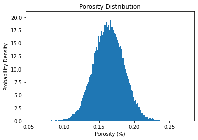
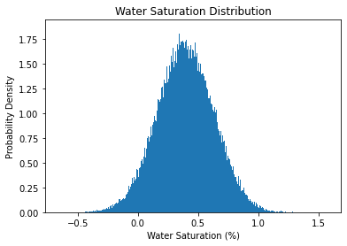
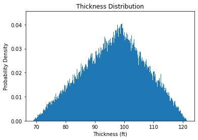
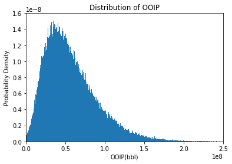
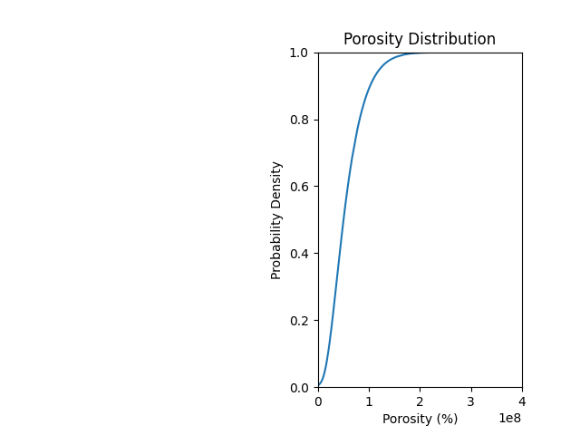

# Monte Carlo Reservoir Simulation and Analysis

## Overview

MonteCarloSimulation.py is a Python script designed to simulate and analyze petroleum reservoir properties such as porosity, saturation, area, and thickness to estimate the Original Oil in Place (OOIP). It utilizes Monte Carlo simulation techniques to generate distributions for these properties and calculates the corresponding OOIP. The script also provides visualizations of the distributions and cumulative density functions (CDF) for better analysis.

## Installation

Ensure you have Python 3.x installed on your system along with the following dependencies:

- numpy
- pandas
- matplotlib
- scipy

You can install these dependencies using pip:

```bash
pip install numpy pandas matplotlib scipy
```

## Usage

1. Clone the repository:

```bash
git clone https://github.com/NasirliToghrul/MonteCarloSimulation.git
```

2. Navigate to the project directory:

```bash
cd MonteCarloSimulation
```

3. Run the Python script:

```bash
python montecarlosimulation.py
```

4. After running the script, you will get the graphs named `Porosity`, `WaterSaturation`, `ThicknessDistribution`, `PorosityDistribution` and `OOIPDistribution`.

## Parameters

The script utilizes the following statistics for reservoir properties:

- Porosity Statistics (fraction)
  - Mean: 0.163906
  - Standard Deviation: 0.021390084

- Saturation Statistics (fraction)
  - Mean: 0.39338
  - Standard Deviation: 0.235478469
  - Min: 0.1284
  - Max: 0.6256

- Area Statistics (acres)
  - Mean: 715.29025
  - Min: 205.339
  - Max: 1890.78

- Thickness Statistics (feet)
  - Mean: 99.08016
  - Min: 68.8968
  - Max: 121.3896

- Net-to-Gross Ratio: 0.87
- Oil Formation Volume Factor (FVF): 1.065

## Output

The script generates a histogram depicting the distribution of OOIP (Original Oil in Place) along with histograms for porosity, saturation, and thickness distributions. Additionally, it calculates and prints the percentiles of the OOIP distribution and Porosity Distribution.

## Example Graphs











## Credits

This script was developed by Toghrul Nasirli.

---